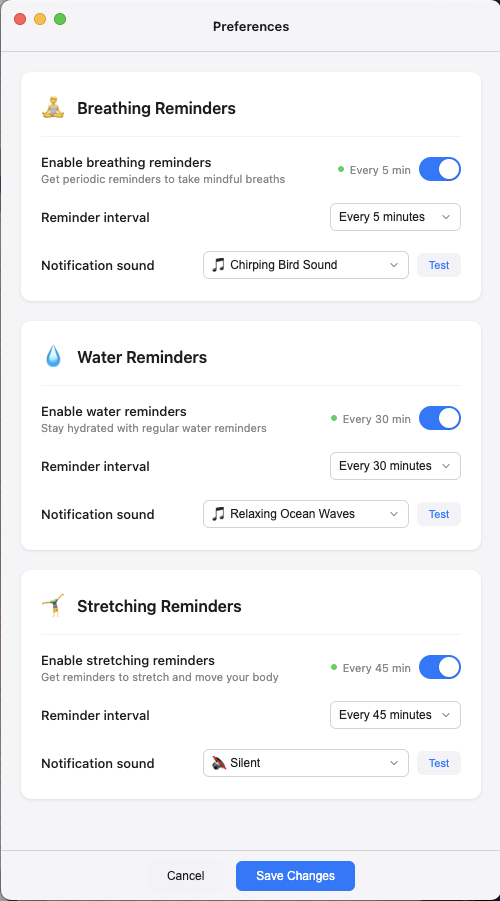

# 🧘 Mindful Wellness App

A lightweight, cross-platform desktop application that helps you maintain mindful wellness habits throughout your workday. The app runs quietly in your system tray/menu bar and sends gentle reminders to take wellness breaks at customizable intervals.

## 🌟 Features

- **Smart Notifications**: Receive motivational reminders with randomized messages
- **Multiple Reminder Types**: Wellness exercises, water hydration, and stretching breaks
- **Customizable Intervals**: Set independent intervals for each reminder type
- **Nature Sound Integration**: Choose different sounds for each reminder type
- **Guided Wellness**: Various wellness techniques including:
  - 4-4-4 breathing (inhale, hold, exhale)
  - 4-7-8 breathing technique
  - Box breathing
  - Simple deep breathing exercises
- **System Tray Integration**: Runs unobtrusively in your menu bar/system tray
- **Auto-start Option**: Option to start automatically when you log in
- **Test Notifications**: Try out notifications before setting your schedule
- **Quick Exercises**: Access instant breathing exercises from the menu
- **Cross-platform**: Works on macOS, Windows, and Linux

## 📸 Screenshots

### Notification Preferences



_Customize your notification preferences to suit your needs from Sound, Interval, and Auto-start options_

## 🎯 Why Use This App?

Regular breathing breaks can help:

- Reduce stress and anxiety
- Improve focus and productivity
- Lower blood pressure
- Enhance mindfulness throughout the day
- Prevent burnout during long work sessions

## 📋 Prerequisites

Before installing, make sure you have:

- **Bun.js** (latest version) - [Download here](https://bun.sh/)
- **Node.js** (v18 or higher) - [Download here](https://nodejs.org/)
- **Git** - [Download here](https://git-scm.com/)

## 🚀 Installation

### 1. Clone the Repository

```bash
git clone <your-repository-url>
cd mindful-breathing-app
```

### 2. Install Dependencies

```bash
bun install
```

### 3. Build and Run

```bash
# Development mode (with auto-rebuild)
bun run dev

# Or build and start
bun run start
```

### 4. Build for Distribution (Optional)

```bash
# Create distributable package
bun run dist
```

## 💻 Usage

### Getting Started

1. **Launch the App**: Run `bun run dev` or `bun run start`
2. **Find the Icon**: Look for the wellness app icon in your menu bar (macOS) or system tray (Windows/Linux)
3. **Initial Setup**: The app will show a welcome notification confirming it's running
4. **Default Settings**: Wellness reminders are set to every 30 minutes by default

### Menu Options

Right-click the tray icon to access:

- **📢 Test Notification**: Try out a wellness reminder
- **🎯 Quick Wellness Exercise**: Immediate guided wellness session
- **⏱️ Reminder Interval**: Choose your preferred reminder frequency
- **🔊 Notification Sound**: Select from relaxing nature sounds or silent mode
- **🚀 Start at Login**: Toggle auto-start when your computer boots
- **❌ Quit**: Stop the application

### Notification Types

The app sends two types of notifications:

1. **Reminder Notifications**: Motivational messages encouraging you to take a wellness break
2. **Guided Exercise Notifications**: Step-by-step wellness instructions

## 🛠️ Development

### Project Structure

```
mindful-breathing-app/
├── src/                  # Source code (modular architecture)
│   ├── main.ts           # Main application entry point
│   ├── utils/            # Core utilities (sound, notifications, settings)
│   ├── types/            # TypeScript interfaces and types
│   ├── data/             # Data files (messages, sounds, instructions)
│   ├── reminders/        # Reminder implementations (breathing, water, stretching)
│   └── ui/               # User interface components
├── package.json          # Dependencies and scripts
├── tsconfig.json         # TypeScript configuration
├── icons/                # App icons
├── sounds/               # Nature sound files for notifications
├── screenshots/          # App screenshots for documentation
├── dist/                 # Built files (auto-generated)
├── release/              # Distribution packages (auto-generated)
└── README.md            # This file
```

### Available Scripts

```bash
# Development with auto-rebuild
bun run dev

# Production build and run
bun run start

# Build TypeScript only
bun run build:ts

# Create distribution package
bun run dist
```

### Tech Stack

- **Runtime**: Bun.js
- **Framework**: Electron
- **Language**: TypeScript
- **Notifications**: node-notifier
- **Settings**: electron-store
- **Architecture**: Modular, extensible plugin system
- **Platform**: Cross-platform desktop

## 🔧 Configuration

### Reminder Intervals

Choose from predefined intervals:

- Every 1 minute
- Every 5 minutes
- Every 15 minutes
- Every 30 minutes (default)
- Every 45 minutes
- Every 60 minutes

### Auto-start

Enable the app to start automatically when you log in to your computer. This setting is managed through your system's login items.

## 🎨 Customization

### Adding New Messages

Edit the `messages` array in `index.ts` to add your own motivational breathing reminders:

```typescript
const messages: string[] = [
  'Your custom message here! 🌟',
  // ... add more messages
]
```

### Adding New Breathing Techniques

Add new techniques to the `breathingInstructions` array:

```typescript
const breathingInstructions: string[] = [
  'Your custom breathing technique 🫁',
  // ... add more techniques
]
```

## 🐛 Troubleshooting

### Common Issues

**App won't start:**

- Ensure Bun.js is installed: `bun --version`
- Try rebuilding: `bun run build:ts`
- Check for port conflicts or permission issues

**Notifications not showing:**

- Check your system's notification settings
- Ensure notification permissions are granted
- Try the "Test Notification" option from the menu

**App not in system tray:**

- The app may take a few seconds to appear
- Check if it's running: look for Electron processes
- Restart the app if needed

### Getting Help

If you encounter issues:

1. Check the console output for error messages
2. Ensure all dependencies are installed correctly
3. Try running in development mode: `bun run dev`
4. Check your system's notification and tray settings

## 📄 License

This project is open source. Feel free to modify and distribute according to your needs.

## 🤝 Contributing

Contributions are welcome! Whether it's:

- Adding new breathing techniques
- Improving the user interface
- Fixing bugs
- Adding new features

Feel free to submit issues and pull requests.

## 🙏 Acknowledgments

- Built with Electron for cross-platform compatibility
- Uses node-notifier for system notifications
- Inspired by mindfulness and productivity practices

---

**Start your mindful breathing journey today! 🧘‍♀️**

_Remember: This app is a tool to support your wellness routine. For serious breathing or health issues, please consult with healthcare professionals._
